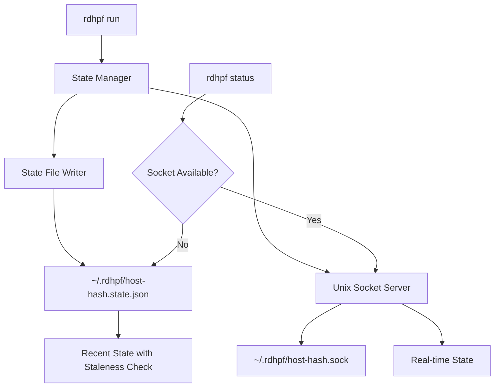

# Status Improvement Design: State File + Unix Socket Hybrid

## Problem Statement

The current `rdhpf status` implementation has critical limitations:

### Current Limitations
1. **No Container ID tracking**: Shows `"unknown"` because it parses `lsof` output which doesn't preserve container metadata
2. **No Duration tracking**: Hardcoded to `0s` because there's no persistent state tracking when forwards were created
3. **Stale information**: Parses SSH process state rather than querying the running `rdhpf run` instance's in-memory state
4. **No access to failure reasons**: Cannot show why a forward is in "conflict" or "pending" state

### Root Cause
`rdhpf status` is a **separate process** from `rdhpf run` with no inter-process communication (IPC) mechanism. It attempts to infer state from SSH process inspection, which is inherently limited.

---

## Status Field Semantics

### Current Status Values
Based on analysis of [`internal/state/model.go`](internal/state/model.go) and [`internal/reconcile/reconciler.go`](internal/reconcile/reconciler.go):

| Status | Meaning | Reason Field Usage | Example |
|--------|---------|-------------------|---------|
| `active` | Forward successfully established and TCP probe passed | Empty (unused) | Port is working correctly |
| `conflict` | Port conflict - cannot establish forward | Error explanation | `"port already in use after 5 retry attempts"` |
| `pending` | Forward created but TCP probe failed | Why it's pending | `"port not responding"` |

### Proposed Refinements

**Keep current statuses** but enhance documentation:

```go
// ForwardState represents the current state of a port forward
type ForwardState struct {
    ContainerID string        // Docker container ID (12-char short form)
    Port        int           // Local port number
    Status      string        // "active", "conflict", "pending"
    Reason      string        // Human-readable explanation (used for conflict/pending)
    CreatedAt   time.Time     // When forward was first attempted
    UpdatedAt   time.Time     // Last status change
}
```

**Status Definitions:**
- **`active`**: Forward is established and verified (TCP probe succeeded)
  - Reason: Always empty
  - User action: None needed
  
- **`conflict`**: Cannot establish forward due to port collision
  - Reason: Examples:
    - `"port already in use after 5 retry attempts"`
    - `"bind: address already in use"`
  - User action: Free the port or stop conflicting container
  
- **`pending`**: Forward was created but validation failed
  - Reason: `"port not responding"` (TCP probe timeout)
  - User action: Check if remote service is actually listening

---

## Design: State File + Unix Socket Hybrid

### Architecture Overview



### Phase 1: State File (Quick Win)

#### File Location
```
~/.rdhpf/{host-hash}.state.json
```

Where `{host-hash}` is `base64(sha256(host))[:12]` to ensure unique files per host.

#### File Format

```json
{
  "version": "1.0",
  "host": "ssh://user@example.com",
  "pid": 12345,
  "started_at": "2025-11-27T15:00:00Z",
  "updated_at": "2025-11-27T15:30:45Z",
  "forwards": [
    {
      "container_id": "abc123def456",
      "local_port": 8080,
      "remote_port": 8080,
      "status": "active",
      "reason": "",
      "created_at": "2025-11-27T15:01:23Z",
      "updated_at": "2025-11-27T15:01:24Z"
    },
    {
      "container_id": "xyz789abc123",
      "local_port": 5432,
      "remote_port": 5432,
      "status": "conflict",
      "reason": "port already in use after 5 retry attempts",
      "created_at": "2025-11-27T15:02:10Z",
      "updated_at": "2025-11-27T15:02:15Z"
    }
  ]
}
```

#### Staleness Detection

```go
const maxStateAge = 10 * time.Second

func isStateStale(state *StateFile) bool {
    age := time.Since(state.UpdatedAt)
    return age > maxStateAge
}
```

If stale, `rdhpf status` should warn:
```
Warning: State file is 45s old. rdhpf may not be running.
```

#### Write Strategy

**Background writer goroutine** in `rdhpf run`:
```go
// Update state file every 2 seconds
ticker := time.NewTicker(2 * time.Second)
go func() {
    for {
        select {
        case <-ticker.C:
            writeStateFile(stateManager.GetActual())
        case <-ctx.Done():
            return
        }
    }
}()
```

**Also write on state changes** for immediate updates.

#### File Locking

Use `flock` for safe concurrent access:
```go
import "golang.org/x/sys/unix"

func writeStateFile(path string, data []byte) error {
    f, err := os.OpenFile(path, os.O_RDWR|os.O_CREATE, 0600)
    if err != nil {
        return err
    }
    defer f.Close()
    
    // Acquire exclusive lock
    if err := unix.Flock(int(f.Fd()), unix.LOCK_EX); err != nil {
        return err
    }
    defer unix.Flock(int(f.Fd()), unix.LOCK_UN)
    
    // Write atomically via temp file + rename
    return atomicWrite(f, data)
}
```

#### Cleanup Strategy

**On Graceful Shutdown:**
```go
// In cleanup() function
os.Remove(stateFilePath)
```

**On Crash/Kill:**
State file remains but becomes stale (detected by age).

**Orphan Detection:**
```go
// Check if PID in state file is still running
if !processExists(state.PID) {
    logWarning("Process %d not found, state may be stale", state.PID)
}
```

---

### Phase 2: Unix Socket (Real-time Queries)

#### Socket Location
```
~/.rdhpf/{host-hash}.sock
```

#### Protocol: JSON-RPC over Unix Socket

**Request Format:**
```json
{
  "method": "status",
  "params": {}
}
```

**Response Format:**
```json
{
  "result": {
    "host": "ssh://user@example.com",
    "pid": 12345,
    "started_at": "2025-11-27T15:00:00Z",
    "forwards": [...]
  },
  "error": null
}
```

#### Future Commands (Extensibility)

Socket enables future enhancements:
```json
{"method": "reload"}         // Reload configuration
{"method": "pause"}          // Pause forwarding
{"method": "resume"}         // Resume forwarding
{"method": "health"}         // Health check
```

#### Implementation

**Server (in rdhpf run):**
```go
func startSocketServer(ctx context.Context, state *state.State) error {
    socketPath := getSocketPath(host)
    
    // Clean up any stale socket
    os.Remove(socketPath)
    
    listener, err := net.Listen("unix", socketPath)
    if err != nil {
        return err
    }
    
    go func() {
        <-ctx.Done()
        listener.Close()
        os.Remove(socketPath)
    }()
    
    go func() {
        for {
            conn, err := listener.Accept()
            if err != nil {
                return
            }
            go handleConnection(conn, state)
        }
    }()
    
    return nil
}

func handleConnection(conn net.Conn, state *state.State) {
    defer conn.Close()
    
    var req Request
    if err := json.NewDecoder(conn).Decode(&req); err != nil {
        return
    }
    
    switch req.Method {
    case "status":
        forwards := state.GetActual()
        response := StatusResponse{
            Host: host,
            PID: os.Getpid(),
            StartedAt: startTime,
            Forwards: forwards,
        }
        json.NewEncoder(conn).Encode(response)
    }
}
```

**Client (in rdhpf status):**
```go
func getStatusViaSocket(socketPath string) ([]Forward, error) {
    conn, err := net.Dial("unix", socketPath)
    if err != nil {
        return nil, err
    }
    defer conn.Close()
    
    req := Request{Method: "status"}
    if err := json.NewEncoder(conn).Encode(req); err != nil {
        return nil, err
    }
    
    var resp StatusResponse
    if err := json.NewDecoder(conn).Decode(&resp); err != nil {
        return nil, err
    }
    
    return resp.Forwards, nil
}
```

---

## Graceful Degradation: Socket → File Fallback

```go
func getStatus(host string) ([]Forward, error) {
    socketPath := getSocketPath(host)
    
    // Try Unix socket first (real-time)
    forwards, err := getStatusViaSocket(socketPath)
    if err == nil {
        return forwards, nil
    }
    
    // Fallback to state file
    stateFilePath := getStateFilePath(host)
    state, err := readStateFile(stateFilePath)
    if err != nil {
        return nil, fmt.Errorf("socket unavailable and state file unreadable: %w", err)
    }
    
    // Check staleness
    if isStateStale(state) {
        logWarning("State file is %s old, may be stale", time.Since(state.UpdatedAt))
    }
    
    return state.Forwards, nil
}
```

---

## Duration Calculation

With `CreatedAt` timestamp, duration is calculated at display time:

```go
func (f Forward) Duration() time.Duration {
    return time.Since(f.CreatedAt)
}

// In status display
duration := time.Since(forward.CreatedAt).Round(time.Second)
```

---

## State Management Changes

### Extend ForwardState

```go
// internal/state/model.go
type ForwardState struct {
    ContainerID string
    Port        int
    Status      string        // "active", "conflict", "pending"
    Reason      string        // Explanation for non-active states
    CreatedAt   time.Time     // NEW: When forward first attempted
    UpdatedAt   time.Time     // NEW: Last status change
}
```

### Update State Methods

```go
func (s *State) SetActual(containerID string, port int, status string, reason string) {
    s.mu.Lock()
    defer s.mu.Unlock()
    
    if s.actual[containerID] == nil {
        s.actual[containerID] = make(map[int]ForwardState)
    }
    
    existing := s.actual[containerID][port]
    now := time.Now()
    
    createdAt := now
    if !existing.CreatedAt.IsZero() {
        createdAt = existing.CreatedAt  // Preserve original creation time
    }
    
    s.actual[containerID][port] = ForwardState{
        ContainerID: containerID,
        Port:        port,
        Status:      status,
        Reason:      reason,
        CreatedAt:   createdAt,
        UpdatedAt:   now,
    }
}
```

---

## Migration & Compatibility

### Backward Compatibility

1. **No state file exists**: `rdhpf status` shows "No running instance found"
2. **Old version running**: State file doesn't exist, falls back to current `lsof` parsing
3. **New version running**: Uses state file or socket

### Version Detection

```json
{
  "version": "1.0",
  ...
}
```

If version field missing or incompatible, show warning.

---

## Implementation Summary

### Phase 1 Tasks (State File)
1. Add `CreatedAt`/`UpdatedAt` to `ForwardState` struct
2. Create `internal/statefile` package with:
   - `Writer` (background goroutine + on-demand writes)
   - `Reader` (with staleness checking)
   - `PathResolver` (host hash calculation)
3. Modify `rdhpf run` to start state file writer
4. Modify `rdhpf status` to read state file
5. Add cleanup on graceful shutdown
6. Add file locking for concurrent access
7. Tests for state persistence

### Phase 2 Tasks (Unix Socket)
1. Create `internal/socket` package with:
   - `Server` (JSON-RPC handler)
   - `Client` (request/response)
2. Modify `rdhpf run` to start socket server
3. Modify `rdhpf status` to try socket first, fallback to file
4. Add protocol documentation
5. Tests for socket IPC

---

## Open Questions

1. **State file retention**: Delete immediately on exit or keep for debugging?
   - **Recommendation**: Delete on graceful exit, warn if stale on crash
   
2. **Permissions**: Should state file be 0600 (owner only)?
   - **Recommendation**: Yes, matches SSH key permissions
   
3. **Multiple instances**: How to handle multiple `rdhpf run` for same host?
   - **Current**: Only one allowed (ControlMaster prevents it)
   - **Action**: Document this limitation

4. **Windows support**: Unix sockets on Windows?
   - **Phase 1**: State file works on all platforms
   - **Phase 2**: Named pipes for Windows socket equivalent

---

## Success Criteria

After implementation:

```bash
$ rdhpf status --host ssh://user@host
CONTAINER ID             LOCAL                REMOTE       STATE      DURATION     REASON
----------------------------------------------------------------------------------------------------
abc123def456            127.0.0.1:8080       8080         active     2m15s        
xyz789abc123            127.0.0.1:5432       5432         conflict   1m30s        port already in use after 5 retry attempts
def456ghi789            127.0.0.1:3000       3000         pending    45s          port not responding
```

**Key improvements:**
✅ Accurate container IDs  
✅ Actual duration since creation  
✅ Real-time state from running process  
✅ Clear failure reasons  