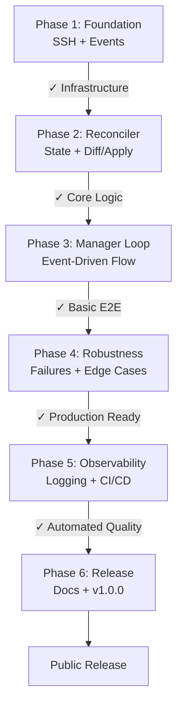

# Implementation Plan: Docker Host Port Forwarding

**Branch**: `[001-docker-host-port-forwarding]` | **Date**: 2025-11-09 | **Spec**: specs/001-docker-host-port-forwarding/spec.md  
**Input**: Feature specification from `/specs/001-docker-host-port-forwarding/spec.md`

## Summary

Implement an event-driven port-forwarding helper for a remote DOCKER_HOST reachable via SSH (ssh://).
The tool runs as a long-lived daemon that:

- Maintains a single OpenSSH ControlMaster session to the Docker host.
- Subscribes to Docker container events (JSON) over SSH and reacts with p99 < 2s latency (target: < 1s).
- For each container, manages all published host ports together (start: add all; stop/die: remove all).
- Forwards only published host ports (HostConfig.PortBindings). Exposed-only container ports are ignored.
- Always targets remote 127.0.0.1:hostPublishedPort. Local listeners bind 127.0.0.1:[port] only.
- Is non-interactive; emits structured logs; provides `rdhpf status` for diagnostics.
- Self-heals on failures: re-creates the master session and reconciles desired vs actual forwards.

Special behavior and corner cases:
- "Last event wins": if a Start event arrives for a port already forwarded to a different container,
  the manager re-plans and (if needed) rebinds the port to reflect the latest desired state.
- Collision policy: no forward on collision; Docker itself prevents two containers publishing the same host port.
  The helper logs conflicts and auto-retries when the port becomes available.

## Technical Context

**Language/Version**: Go 1.22 (single static binary)  
**Primary Dependencies**: System OpenSSH client (runtime), Go stdlib (os/exec, context, net), cobra (CLI), log/slog (structured logging)  
**Storage**: N/A (in-memory state only)  
**Testing**: go test (unit + integration); test harness to simulate docker events via SSH/stdio streams  
**Target Platform**: macOS runners (client), Linux remote host; release binaries for Linux x86_64 and macOS  
**Project Type**: single  
**Performance Goals**: p99 < 2s from container event to forward add/remove (target: < 1s for all ports of a container)  
**Constraints**: SSH-only DOCKER_HOST; non-interactive; minimal dependencies; deterministic/idempotent operations  
**Scale/Scope**: Tens of containers/ports per job; single manager process per runner

## Constitution Check

*GATE: Must pass before Phase 0 research. Re-check after Phase 1 design.*

- [x] Tests: REQUIRED (unit for reconcilers/event parsing; integration for SSH ControlMaster + docker events flow)
- [x] Simplicity: Minimal deps; use battle-tested OpenSSH; avoid reimplementing SSH
- [x] Reliability: Keep-alives; health checks; idempotent diff/apply; reconcile on startup and after errors
- [x] Observability: Structured logs with levels; `status` command for diagnostics
- [x] Security: Loopback binds; StrictHostKeyChecking on by default; redact sensitive fields

## Project Structure

### Documentation (this feature)

```text
specs/001-docker-host-port-forwarding/
├── plan.md              # This file
├── spec.md              # Requirements and user stories
├── checklists/
│   └── requirements.md  # Quality checklist (passed)
└── tasks.md             # To be generated via /speckit.tasks
```

### Source Code (repository root)

```text
cmd/rdhpf/
└── main.go

internal/
├── config/
│   └── config.go            # flags/env, modes (all-published, fixed)
├── logging/
│   └── logger.go            # slog setup, redaction helpers
├── ssh/
│   ├── master.go            # open/close master, -O check, keep-alives
│   ├── forward.go           # -O forward / -O cancel ops
│   └── controlpath.go       # stable ControlPath derivation
├── docker/
│   ├── events.go            # stream events as JSON via SSH
│   └── inspect.go           # inspect container; extract PortBindings
├── reconcile/
│   └── reconciler.go        # desired vs actual; idempotent diff/apply
├── state/
│   └── model.go             # container→ports, forward status (active/conflict)
├── manager/
│   └── manager.go           # orchestrates events→plan→apply ("last event wins")
├── status/
│   └── status.go            # `rdhpf status` snapshot output
└── util/
    └── tcpcheck.go          # local listener probe with timeout

tests/
├── unit/
│   ├── events_parse_test.go
│   ├── reconciler_test.go
│   ├── forward_plan_test.go
│   └── state_model_test.go
└── integration/
    ├── harness/
    │   ├── fake_docker_events.go   # simulated JSON line stream
    │   └── ssh_stub.go             # optional SSH process stub for CI portability
    └── end_to_end_test.go          # ControlMaster + docker events via ssh localhost
```

**Structure Decision**: Single Go module with internal packages and one CLI entrypoint. OpenSSH is invoked via `os/exec` with ControlMaster for deterministic and safe forward lifecycle.

## Implementation Phases

### Phase 1: Foundation & Core Abstractions (Week 1)
**Goal**: Establish project structure, SSH management, and basic event handling

**Deliverables**:
1. Go module initialization with project layout
2. SSH ControlMaster wrapper:
   - Open/close master session with keep-alives
   - Health check (-O check) with watchdog
   - Auto-recreate on failure
3. Docker events reader:
   - Stream JSON events via SSH
   - Parse start/die events → typed structs
   - Watchdog: restart stream on error, trigger reconcile
4. Basic structured logging (slog) with redaction

**Tests** (unit + integration):
- Unit: Event JSON parsing for start/die/stop
- Unit: ControlPath derivation (stable, collision-free)
- Integration: ControlMaster lifecycle on localhost SSH (open, check, exit)

**Checkpoint**: Can we maintain a stable SSH master and parse events reliably?

---

### Phase 2: State & Reconciliation Engine (Week 2)
**Goal**: Core logic for desired vs actual state and idempotent operations

**Deliverables**:
1. State model:
   - Container → published ports mapping
   - Forward status (active/conflict/pending)
2. Reconciler:
   - Diff desired vs actual
   - Produce add/remove/no-op decisions
   - Container-scoped batching (all ports together)
   - "Last event wins" logic
3. Forward operations:
   - Execute -O forward / -O cancel commands
   - Handle conflicts (mark, log, retry with backoff)
   - Validate via local TCP probes

**Tests** (unit + integration):
- Unit: Reconciler diff logic, idempotency
- Unit: Batch operations (all ports per container)
- Unit: "Last event wins" rebinding scenarios
- Unit: Forward planner command generation
- Integration: Execute -O forward/-O cancel on localhost

**Checkpoint**: Does reconciliation produce correct, idempotent diff/apply decisions?

---

### Phase 3: Event-Driven Manager Loop (Week 3)
**Goal**: Wire events → state → reconcile → apply

**Deliverables**:
1. Manager orchestrator:
   - Subscribe to events
   - On start: inspect container → extract PortBindings
   - On die/stop: mark container stopped
   - Trigger reconcile after each event
   - "Last event wins" rebinding across events
2. Startup reconciliation:
   - Query current containers (docker ps + inspect via SSH)
   - Build initial desired state
   - Apply forwards
3. CLI skeleton (`rdhpf run --host ssh://user@host`)

**Tests** (unit + integration):
- Unit: Manager event handling logic
- Integration: Event → forward established < 2s (target < 1s)
- Integration: Container stop → forward removed < 2s (target < 1s)
- Integration: "Last event wins" port rebind scenario
- Integration: Startup reconcile with running containers

**Checkpoint**: Full event-driven flow works end-to-end?

---

### Phase 4: Robustness & Edge Cases (Week 4)
**Goal**: Handle failures, conflicts, and corner cases

**Deliverables**:
1. Conflict handling:
   - Port already in use → log, skip, auto-retry with backoff
2. Connection loss recovery:
   - SSH master dies → recreate + reconcile all forwards
   - Event stream breaks → restart + immediate reconcile
3. TIME_WAIT handling:
   - Graceful -O cancel for clean port release
   - Backoff retry on bind failures
4. Graceful shutdown:
   - -O exit on SIGTERM/SIGINT
   - Release all ports cleanly
5. Published-ports-only enforcement:
   - Verify exposed-only ports are ignored

**Tests** (unit + integration):
- Unit: Conflict retry logic with backoff
- Integration: Kill master → self-heal within 10s
- Integration: Occupy port → conflict logged, others succeed, auto-retry on release
- Integration: Unclean disconnect → TIME_WAIT → eventual bind success
- Integration: Exposed-only container → no forwards created
- Integration: Graceful shutdown releases all ports

**Checkpoint**: System self-heals correctly under failures?

---

### Phase 5: Observability & CI/CD (Week 5)
**Goal**: Production-grade logging, status command, and automated testing

**Deliverables**:
1. Structured logging refinement:
   - Correlation IDs per container/forward
   - Redact sensitive fields (hosts, keys)
   - Debug/trace modes (--log-level flag)
2. Status command (`rdhpf status`):
   - Print active forwards with container IDs
   - Show conflicts/pending with reasons
   - Display master session health
3. Test harness:
   - Fake docker events generator for deterministic scenarios
   - Optional SSH stub for testing without real SSH
4. GitHub Actions workflows:
   - Lint (golangci-lint)
   - Unit tests (all packages)
   - Integration tests (localhost SSH on GitHub-hosted runners)
   - Build static binaries for Linux + macOS
   - Release on tag with checksums

**Tests** (validation):
- All existing tests run in CI
- Test harness validates timing budgets (p99 < 2s)
- End-to-end smoke test with real containers

**Checkpoint**: Can we deploy and debug effectively in production?

---

### Phase 6: Documentation & Release (Week 6)
**Goal**: Production-ready v1.0.0 release

**Deliverables**:
1. README.md:
   - Install instructions
   - Quickstart examples (dev workflow + CI)
   - Configuration reference (flags, env vars)
2. Troubleshooting guide:
   - Common errors and resolutions
   - SSH connectivity issues
   - Port conflict debugging
3. LICENSE (MIT)
4. CHANGELOG.md
5. Release v1.0.0 with binaries and checksums

**Checkpoint**: Ready for external users?

---

## Testing Strategy

### Unit Tests (fast, deterministic, no external deps)
- Event parsing: docker events JSON → typed events (start/die) with container IDs
- Inspect parsing: extract HostConfig.PortBindings → flatten to hostPublishedPorts per container
- Reconciler logic:
  - Desired vs Actual → add/remove/no-op decisions are idempotent
  - Container-batch operations (all ports together)
  - "Last event wins" rule: Start for container B on port P supersedes existing forward for container A on P
- Forward planner:
  - Produces exact -O forward/-O cancel commands per decision
  - Conflict when local port in use → mark conflict, continue with other ports
- State model transitions and query correctness

### Integration Tests (with SSH; GitHub-hosted runners with localhost SSH)
- ControlMaster lifecycle:
  - Open master (`-MNf ...` with keep-alives), `-O check` succeeds
  - `-O exit` releases ports immediately
- Event-to-forward end-to-end:
  - Start event for container with two published ports → both forwards active within p99 < 2s (target < 1s)
  - Die/stop event → both forwards removed within p99 < 2s (target < 1s)
- "Last event wins":
  - Forward established for container A on port 5432
  - Start event for container B also publishing 5432
  - Manager rebinds to B (cancel A/forward B); probe passes within p99 < 2s
- Conflict handling:
  - Occupy local 6379 before event → conflict logged, other ports still established
  - Release port → auto-retry succeeds
- Liveness & self-heal:
  - Kill master SSH process → manager re-creates master and re-applies forwards automatically within 10s
  - Drop/interrupt events stream → re-open stream; run immediate reconcile; steady state reached
- TIME_WAIT edge:
  - Force unclean forward cancel
  - Ensure retry with backoff and eventual success once OS releases the port
- Published-ports-only:
  - Container with EXPOSE but no -p → no forwards created
  - Container with -p → forwards created

### Test Harness
- Fake "docker events" JSONL generator:
  - Precise control of timing, event order, duplicates
  - Simulate rapid start/stop churn
  - Simulate late/out-of-order events
- Optional SSH stub:
  - Validate ControlMaster command shaping without requiring real SSH
  - Useful for edge-case testing in CI
- Probing utilities:
  - TCP dial to 127.0.0.1:PORT with timeout
  - Assert listener presence/absence
  - Measure latency budgets

### Acceptance Targets (validated in tests)
- p99 ≤ 2s event → forward add/remove for container batches (target < 1s)
- Non-interactive operation; only logs and status outputs
- Published-port-only policy; exposed-only ports ignored
- SSH-only DOCKER_HOST; no TLS mode
- Self-healing on SSH/event failures within 10s

---

## Milestones & Dependencies



---

## Key Risks & Mitigation

| Risk | Impact | Mitigation |
|------|--------|------------|
| SSH subprocess instability | High | Keep-alives, health checks, auto-recreate with reconcile |
| Event stream drops | High | Watchdog + immediate reconcile; idempotent operations |
| Port binding race conditions | Medium | Idempotent operations, backoff retry, "last event wins" |
| Testing SSH on CI | Medium | GitHub-hosted runners support localhost SSH; test harness for edge cases |
| TIME_WAIT delays | Low | Document OS constraints, graceful cancel, backoff retry |
| Performance under load | Low | Container-scoped batching; ControlMaster reuse; lightweight reconciler |

---

## Open Items for Next Phase

1. Create `.specify/memory/constitution.md` alignment documentation if not already present
2. Generate detailed tasks via `/speckit.tasks` command
3. Set up GitHub repository with initial Go module scaffold
4. Confirm SSH localhost availability on GitHub-hosted runners (assumption: yes)

---

## Complexity Tracking

> **Fill ONLY if Constitution Check has violations that must be justified**

| Violation | Why Needed | Simpler Alternative Rejected Because |
|-----------|------------|---------------------------------------|
| — | — | No violations; plan aligns with constitution |
